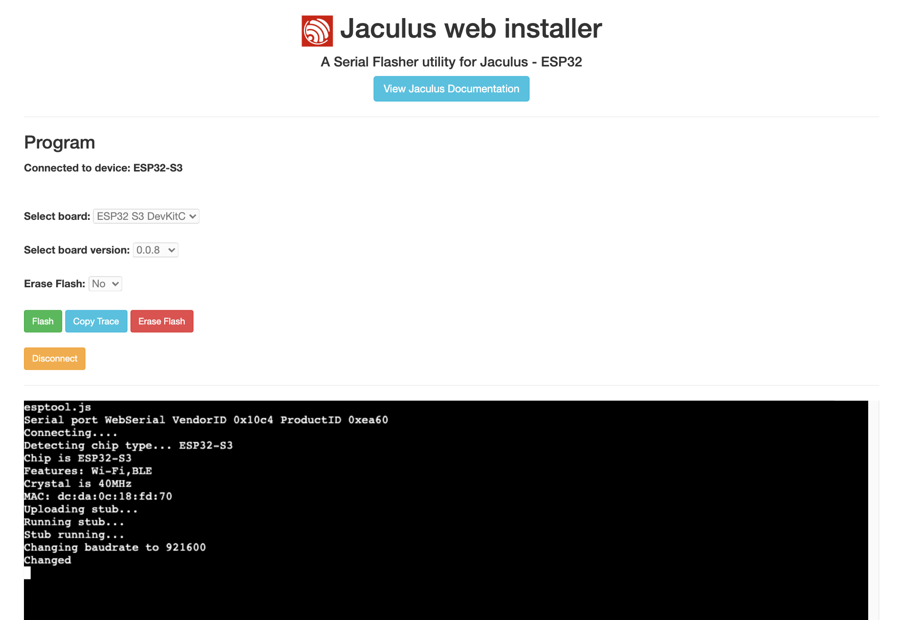
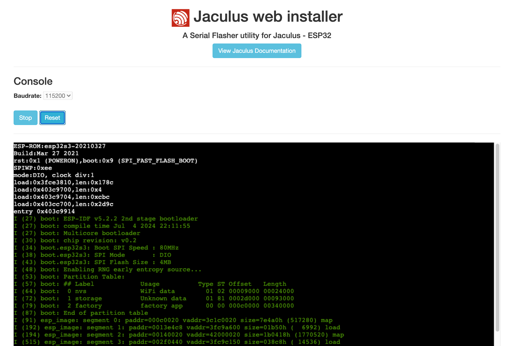

# Using Jaculus web installer

This is a simple web installer for [Jaculus](http://jaculus.org) - JavaScript runtime for embedded devices

Use this tool: [Jaculus web installer](https://installer.jaculus.org/)

### Install Jaculus on your device


### Serial monitor


## Testing it locally

```
npm install
npm run dev
```

Then open http://localhost:1234 in Chrome or Edge. The `npm run dev` step will call Parcel which start a local http server serving `index.html` with compiled `index.ts`.

## Generate build to publish

```
npm install
npm run build
```

Copy the content of `dist` to your static pages service like Github pages.